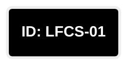
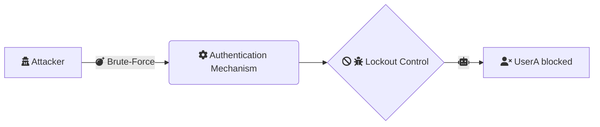
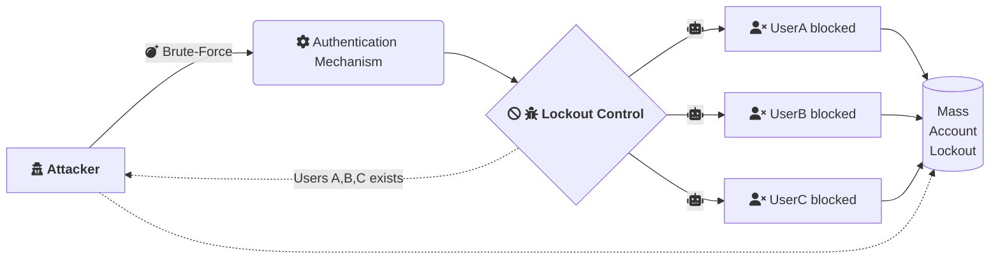
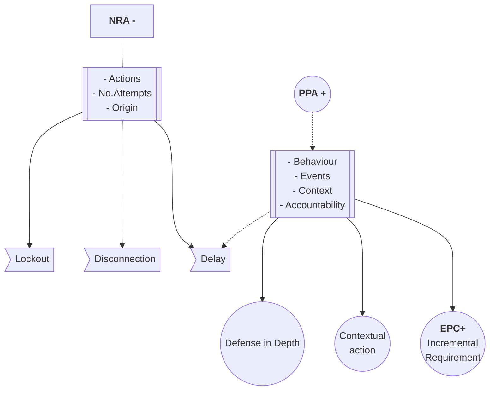

<h1 align="center">Legitimate User Punished by Security Mechanism</h1>


<br/>
<br/>

## Table of contents
* [Overview](#item1)<br>
    * [Logicflow](#Logicflow)
    * [Cross-reference Matrix](#CRM)
* [Insecure Reactive Controls: Authentication](#subitem1)
    * [Premisse](#subitem2)
    * [User perspective](#subitem3)
    * [Outcome](#subitem4)
* [Complexities and Misconceptions](#item2) 
    * [Case analysis](#cveexamples)   
* [Mitigation Insights](#item3) 
* [Conclusion](#item4) 
* [External References](#ref1)
* [Referencing this study](#studyref1)
<br/>

## Overview<a name="item1"></a>

Negative/Reactive controls work in a delicate balance where some undesired actions have been identified on the application/system and should be stopped. 
How it's based on a negative approach (stop/deny/restrict/ban something or someone), it must be implemented carefully, or else a threat actor can [abuse](https://capec.mitre.org/data/definitions/210.html) these negative properties to take advantage of the insecure design to prejudice the legitimate user, enumerate valid resources and disrupt the business logic workflows.

### Logicflow<a name="Logicflow"></a>
In general lines, the relationships between the control and its actions in the LFCS-01 perspective can be seen below: 

```mermaid

flowchart LR
    %%require:tcejorpuhd4s1.1/Logic Flaws, Insecure Design, Appsec
    subgraph <b>Reactive Measures</b>
        Lockout
        Disconnection
        Deactivation 
        Delay
    end
    subgraph <b>LFCS-01</b>
        Control-.->Lockout
        Control-.->Disconnection
        Control-.->Delay
        Control-.->Deactivation
    end
    subgraph <b>Triggers</b>
        Actions-->Control
        Events-.->Control
    end

```

<br>

### Cross-reference Matrix<a name="CRM"></a>
This matrix is meant to be used as a general reference to identify, test, and mitigate the scenario studied in this item.

| **ASVS** | **CWE**  | **OWASP Top 10**  | **ATT&CK**  | **WSTG** | **OAT** | **Techniques** | **Components** | **Properties** |
| :-----: | :-----: | :-----: | :-----: | :-----: | :-----: | :-----: | :-----: | :-----: |

```mermaid
%%{init: {'securityLevel': 'loose', 'theme':'neutral'}}%%
%%require:tcejorpuhd4s1.1
flowchart 
    ASVS(((<b>ASVS</b>))) 
    CWE(((<b>CWE</b>)))
    Top10(((<b>OWASP Top10</b>)))
    ATT&CK(((<b>ATT&CK</b>)))
    WSTG(((<b>WSTG</b>)))
    OAT(((<b>OAT</b>)))
    
    Designing[/Designing\]
    Building[/Building\]
    Testing[/Testing\]
    
    Describing[/Describing\]
    Checking[/Checking\]
    Evaluating[/Evaluating\]
    Identifing[/Identifing\]
    Classifing[/Classifing\]
    
    Awareness[/Awareness\]
    Knowledge[/Knowledge\]
    Behaviors[/Behaviors\]
    
    Tactics>Tactics]
    Techniques>Techniques]
    Procedures>Procedures]
    Vulnerabilities>Vulnerabilities]
    Risks>Risks]
    Taxonomies>Taxonomies]
    Threats>Threats]
    Weakness>Weakness]
    ExpLike>exploitation<br>likelihood]
    Errors>Errors]
    
    ASVS -.-> Designing
    ASVS -.-> Building
    ASVS -.-> Testing
    
    CWE -.-> Describing
    CWE -.-> Checking
    CWE -.-> Evaluating
    CWE -.-> Identifing
    CWE ---> Weakness
    CWE ---> ExpLike
    CWE ---> Errors
    
    Top10 -.-> Awareness
    Top10 -.-> Knowledge
    Top10--->Vulnerabilities
    Top10--->Risks
    
    ATT&CK -.-> Behaviors
    ATT&CK -.-> Knowledge
    ATT&CK--->Tactics
    ATT&CK--->Techniques
    ATT&CK--->Procedures
    
    WSTG -.-> Testing
    OAT -.-> Identifing
    OAT -.-> Classifing
    OAT ---> Threats
    OAT ---> Taxonomies
    OAT -.-> Building
    
```

|1.2.3 <br/> 1.11.1 <br />  1.11.2 <br /> 1.11.3 <br /> 11.1.3 <br />  11.1.4  <br /> 11.1.5 <br /> 11.1.7| 1059 <br/> 770 <br /> 840 <br /> 841 <br /> 754 <br/> 307 | A04:2021 <br/> A07:2021 |T1110.001 <br/>  T1110.002 <br/>  T1110.003 <br/> T1110.004 <br/> T1592.002 <br/> T1589.001 <br/> T1589.002 <br/> T1589.003| BUSL-07 | 015 | Reconnaissance <br/> Brute Force | Credentials <br/> Email Addresses <br/> Employee Names | C <br/> A

<details>
<summary style="font-size:14px">View relationship</summary>
<p>
    



</p></details>

<br/>

## 1 - Insecure Reactive Controls: Authentication<a name="subitem1"></a>

This scenario is maybe the most common one where we're talking about Basic Authentication. In this case the flaw arises from an effort to stop the attacker's activities via application controls. Usually is based on the idea of the maximum number of attempts allowed. After which, the user will be blocked for some time. 

<br/>



### Premisse<a name="subitem2"></a>
This is a negative approach that starts from a legitimate premisse: If someone is trying to guess authentic users credentials many times he will be blocked. 

### User perspective<a name="subitem3"></a>
This scenario leads to all sort of situations from a user perspective starting by the fact that makes no sense at all to have your account blocked if you didn't do anything wrong, so at least thecnicaly it put the companies business at suspect, because seems like they don't know what they doing. They dont have control about users activities. 

### Outcome<a name="subitem4"></a>
In this scenario just the legitimate user has been punished while the attacker just received another insight about how to disrupt that particular business workflow by abusing of the insecure design. 

And other important point about this really ordinary problem can be seem bellow:

In addition the attacker also know which users are valid or not. So it also leads to valid user enumeration, which is specially handy when the attacker is not necessarily trying to guess password, but also the usernames from a blackbox perspective.

## Complexities and Misconceptions<a name="item2"></a>
_[Section in progress]_

Although it is relatively easy to find real word vulnerabilities in this studied case, the main problem remains the misunderstanding about how to handle this situation and the solution. 

### Case analysis<a name="cveexamples"></a> 

Let's take, for example these three CVE IDs below: 

| **ID** | **Software**  | 
| :-----: | :-----: | 
|[CVE-1999-1152](https://nvd.nist.gov/vuln/detail/CVE-1999-1152)|Compaq/Microcom 6000 Access Integrator
|[CVE-1999-1324](https://nvd.nist.gov/vuln/detail/CVE-1999-1324)|VAXstations/Open VMS 5.3
|[CVE-2022-30600](https://nvd.nist.gov/vuln/detail/CVE-2022-30600)|Moodle Platform <=4.0

<br/>

<details>
<summary style="font-size:14px">View analysis #1</summary>
<p><br>
In the first one CVE-1999-1152 the Analysis Description section says: 

```
Compaq/Microcom 6000 Access Integrator does not disconnect a client
after a certain number of failed login attempts, which allows remote
attackers to guess usernames or passwords via a brute force attack.
```

As we can see, the case studied here is so problematic and with such a wild spread misconception about how to handle it that the potential solution also creates new ubiquitous issues. In this way, we have two interesting statements here:

    1. [The affected technology] does not disconnect a client after a certain number of failed login attempts

    2. [Statement 1] allows remote attackers to guess usernames or passwords via a brute force attack


If we implement the first statement we will inevitably put legitimate users at risk of being punished (locked out/disconnected) when threat actors try to brute force their credentials. 

Also important to consider that once it is logically impossible to lock out an account that doesn't exist, the attacker will also be able to guess the valid ones. Guess what? Those blocked! 

In this way, we'll have something like this:

```python
1   IF APPLY(sttmt1):
2       DO(NRA-) 
3   IF NOT(sttm1):
4       EVENT(sttm2)
5   ELSE:
6       DESIGN(PPA+)
    
```

Important to note that our point here is to discuss those less evident side-effects of taking such negative/reactive actions because, of course, in the pseudo-code above, the line **2** is going to mitigate the attack but also prejudice the user, even if the attack was not succeeded. 

And if you don't do that, so you'll hit line **4**, and the attack will continue, and with so, you'll be at risk of having your application, user identity, and client database compromised. 
<br/><br/>
</p></details>

<details>
<summary style="font-size:14px">View analysis #2</summary>
<p><br>
In the second vulnerability CVE-1999-1324 we have the following Analysis Description:
    
```
VAXstations running Open VMS 5.3 through 5.5-2 with VMS DECwindows or
MOTIF do not properly disable access to user accounts that exceed the
break-in limit threshold for failed login attempts, which makes it easier
for attackers to conduct brute force password guessing.
```

And splitting it again into two statements (1. what the technology is missing, and 2. what this can allow threat actors to with), we'll ending up in the same arrangement we saw previously: 


    1. [The affected technology] do not properly disable access to user accounts that exceed the
       break-in limit threshold for failed login attempts

    2. [Statement 1] makes it easier for attackers to conduct brute force password guessing.

<br/>

As you can see, the analysis will return to the same issues we saw in the previous CVE. Here I would like to highlight just one detail: ``` the threshold for failed login attempts ```. This characteristic is directly related to the most common negative/reactive controls, yet, as simple as it seems, it's tricky to conceive some crucial aspects, such as: 

* How to protect administrative accounts.
* How to avoid concurrency-related issues.
* How to avoid account lockout threshold bypass.
* How to establish a fair amount of time until the next round. 
* How to reasonably hit the consensus about how many attempts are enough.
    
</p></details>

<details>
<summary style="font-size:14px">View analysis #3</summary>
<p><br>
    
The CVE-2022-30600 description says: 

```
A flaw was found in moodle where logic used to count failed login attempts
could result in the account lockout threshold being bypassed.

```

As you noticed, we're talking about an entirely different perspective in this case. Here the abuse is due not to a lack of control but a logical bypass. Even though we don't have the proof of concept to figure out how it works precisely, still, we have the [commit](https://git.moodle.org/gw?p=moodle.git;a=commitdiff;h=59b5858da200f63ecb59a9113af2b99ef1496fe5) to fix the issue itself. 
    
```php
  1 /**
  2   * To be called after failed user login.
  3   * @param stdClass $user
  4 + * @throws moodle_exception
  5   */
  6  function login_attempt_failed($user) {
  7      global $CFG;
  8 @@ -888,30 +889,53 @@ function login_attempt_failed($user) {
  9          return;
 10      }
 11 
 12 -    $count = get_user_preferences('login_failed_count', 0, $user);
 13 -    $last = get_user_preferences('login_failed_last', 0, $user);
 14 -    $sincescuccess = get_user_preferences('login_failed_count_since_success', $count, $user);
 15 -    $sincescuccess = $sincescuccess + 1;
 16 -    set_user_preference('login_failed_count_since_success', $sincescuccess, $user);
 17 +    // Force user preferences cache reload to ensure the most up-to-date login_failed_count is fetched.
 18 +    // This is perhaps overzealous but is the documented way of reloading the cache, as per the test method
 19 +    // 'test_check_user_preferences_loaded'.
 20 +    unset($user->preference);
 21 +
 22 +    $resource = 'user:' . $user->id;
*23 +    $lockfactory = \core\lock\lock_config::get_lock_factory('core_failed_login_count_lock');
 24 +
*25 +    // Get a new lock for the resource, waiting for it for a maximum of 10 seconds.
*26 +    if ($lock = $lockfactory->get_lock($resource, 10)) {
 27 +        try {
 28 +            $count = get_user_preferences('login_failed_count', 0, $user);
 29 +            $last = get_user_preferences('login_failed_last', 0, $user);
 30 +            $sincescuccess = get_user_preferences('login_failed_count_since_success', $count, $user);
 31 +            $sincescuccess = $sincescuccess + 1;
 32 +            set_user_preference('login_failed_count_since_success', $sincescuccess, $user);
 33 +
 34 +            if (empty($CFG->lockoutthreshold)) {
 35 +                // No threshold means no lockout.
 36 +                // Always unlock here, there might be some race conditions or leftovers when switching threshold.
 37 +                login_unlock_account($user);
*38 +                $lock->release();
 39 +                return;
 40 +            }
 41 
 42 -    if (empty($CFG->lockoutthreshold)) {
 43 -        // No threshold means no lockout.
 44 -        // Always unlock here, there might be some race conditions or leftovers when switching threshold.
 45 -        login_unlock_account($user);
 46 -        return;
 47 -    }
 48 +            if (!empty($CFG->lockoutwindow) and time() - $last > $CFG->lockoutwindow) {
 49 +                $count = 0;
 50 +            }
 51 
 52 -    if (!empty($CFG->lockoutwindow) and time() - $last > $CFG->lockoutwindow) {
 53 -        $count = 0;
 54 -    }
 55 +            $count = $count + 1;
 56 
 57 -    $count = $count+1;
 58 +            set_user_preference('login_failed_count', $count, $user);
 59 +            set_user_preference('login_failed_last', time(), $user);
 60 
 61 -    set_user_preference('login_failed_count', $count, $user);
 62 -    set_user_preference('login_failed_last', time(), $user);
 63 +            if ($count >= $CFG->lockoutthreshold) {
 64 +                login_lock_account($user);
 65 +            }
 66 
 67 -    if ($count >= $CFG->lockoutthreshold) {
 68 -        login_lock_account($user);
 69 +            // Release locks when we're done.
 70 +            $lock->release();
*71 +        } catch (Exception $e) {
*72 +            // Always release the lock on a failure.
*73 +            $lock->release();
 74 +        }
 75 +    } else {
*76 +        // We did not get access to the resource in time, give up.
*77 +        throw new moodle_exception('locktimeout');
 78      }
 79  }
~          
```
    
    
</p></details>


## Mitigation Insights<a name="item3"></a> 
_[Section in progress]_

The below acronyms refer to approaches and controls related to LFCS 1.1.

|Term| Literal | Value|
--- | --- | ---|
|NRA|Negative Reactive Approach|**-**|
|PPA|Positive Proactive Approach|**+**|
|EPC|Exponential Puzzle Control|**+**|




<br>

_Continue..._

### Checklist
_[Section in progress]_
Review the reference items on the scenario matrix table in the begin, that includes validations as:


<details>
    <summary style="font-size:14px"><b>⚙️ OWASP ASVS</b></summary>
<p><br>

| **Item** | **Control**  | 
| :-----: | :-----: | 
|**V1.2**|[Authentication Architecture](https://github.com/OWASP/ASVS/blob/v4.0.3/4.0/en/0x10-V1-Architecture.md#v12-authentication-architecture)
|**V1.11**|[Business Logic Architecture](https://github.com/OWASP/ASVS/blob/v4.0.3/4.0/en/0x10-V1-Architecture.md#v111-business-logic-architecture)
|**V11.1**|[Business Logic Security](https://github.com/OWASP/ASVS/blob/v4.0.3/4.0/en/0x19-V11-BusLogic.md)

</p></details>

<details>
    <summary style="font-size:14px"><b>⚙️ MITRE ATT&CK</b></summary>
<p><br>

| **ID** | **Requirement**  | 
| :-----: | :-----: | 
|**T1110**|[Brute Force](https://attack.mitre.org/techniques/T1110/) 
|**T1592**|[Gather Victim Host Information](https://attack.mitre.org/techniques/T1592/)

</p></details>

<details>
    <summary style="font-size:14px"><b>⚙️ OWASP Top 10 </b></summary>
<p><br>
 
| **ID** | **Requirement**  | 
| :-----: | :-----: | 
|**A04:2021**|[Insecure Design](https://owasp.org/Top10/A04_2021-Insecure_Design/) 
|**A07:2021**|[Identification and Authentication Failures](https://owasp.org/Top10/A07_2021-Identification_and_Authentication_Failures/)

</p></details>

<details>
    <summary style="font-size:14px"><b>⚙️ OWASP Testing Guide</b></summary>
<p><br>
    
| **ID** | **Requirement**  | 
| :-----: | :-----: | 
|**WSTG-BUSL-07**|[Test Defenses Against Application Misuse](https://github.com/OWASP/wstg/blob/master/document/4-Web_Application_Security_Testing/10-Business_Logic_Testing/07-Test_Defenses_Against_Application_Misuse.md)

</p></details>

_Continue..._

## Conclusion:<a name="item4"></a> 

Besides the fact that this approach is not effective, it also create new problems such as:

* Mass Account Lockout
* Valid User Enumeration
* Business Workflow Disruption
* User Friction/Bad UX 
* Administrative Issues
* Resource consumption

## External References:<a name="ref1"></a> 

* https://owasp.org/
* https://attack.mitre.org/
* https://cwe.mitre.org/
* https://nvd.nist.gov/

## Referencing this study:<a name="studyref1"></a>  
You can use the following format to refer to this study: ```{Project}:{Study Case Id}.{item}```, which in this case means: ```LFWFBD:LFCS-01.1```. In addition, you can also specify the Git after the study references to be more specific, if you need, such as: ```LFWFBD:LFCS-01.1 s4dhulabs``` or yet ```LFWFBD:LFCS-01.1@s4dhulabs```

