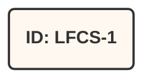
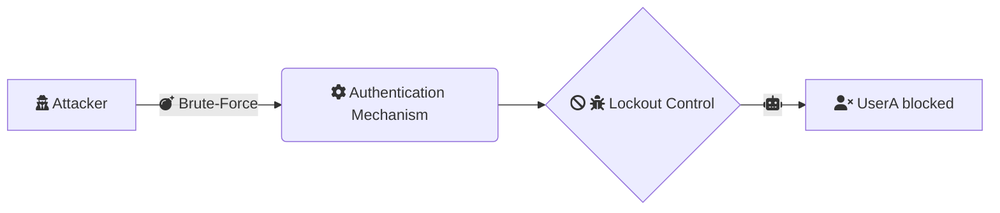
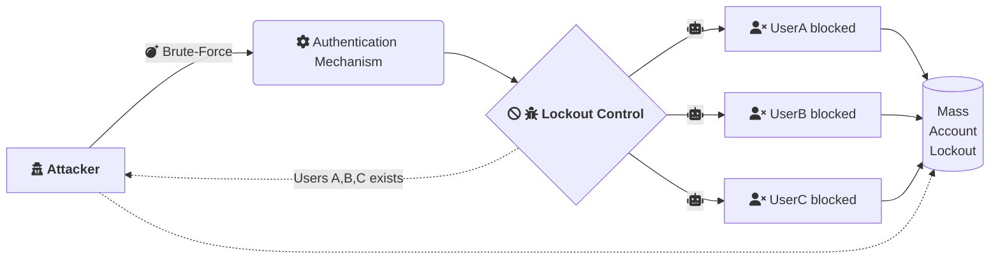
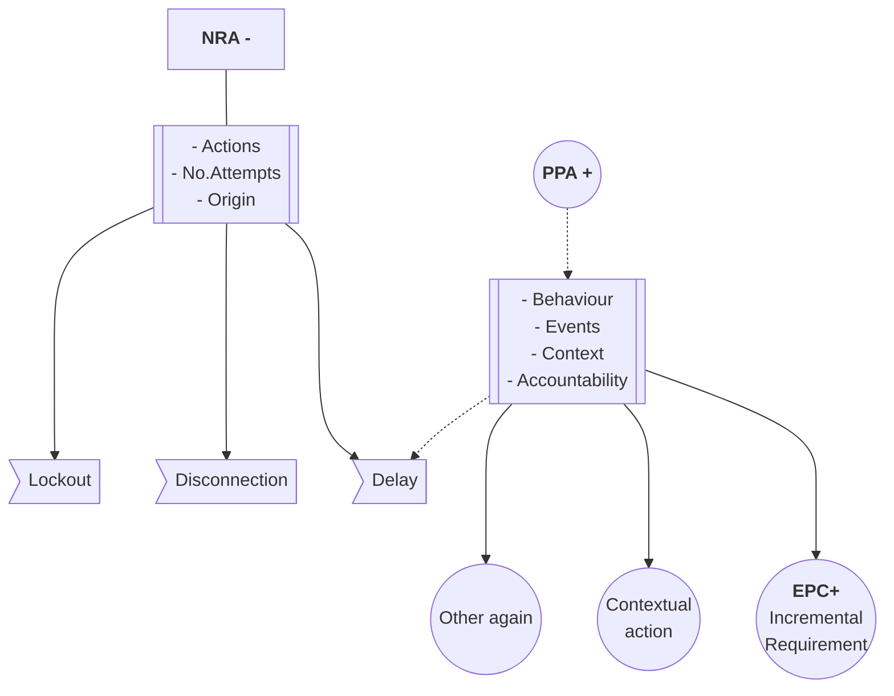

<h1 align="center">Legitimate User Punished by Security Mechanism</h1>


<br/>
<br/>

### Table of contents
1. [Insecure Reactive Controls: Authentication](#item1)
    * [Flow Analysis](#subitem1)
    * [Premisse](#subitem2)
    * [User perspective](#subitem3)
    * [Outcome](#subitem4)
2. [Complexities and Misconceptions](#item2) 
3. [Mitigation Insights](#item3) 
4. [Conclusion](#item4) 
<br/>

## 1.1: Insecure Reactive Controls: Authentication<a name="item1"></a>

Lockout controls work in a delicate balance where some undesired actions have been identified on the application/system and should be stopped. 
How it's based on a negative approach (stop/deny/restrict/ban something or someone), it must be implemented carefully, or else a threat actor can [abuse](https://capec.mitre.org/data/definitions/210.html) these negative properties to take advantage of the insecure design to prejudice the legitimate user, enumerate valid resources and disrupt the business logic workflows.

<br/>

In general lines, the relationships between the control and its actions in the LFCS-1 perspective can be seen below: 

```mermaid
flowchart LR
    subgraph <b>Reactive Actions</b>
    Lockout
    Disconnection
    Delay
    end
    %%subgraph two
    %%b1-->b2
    %%end
    subgraph <b>LFCS-1</b>
    Control-.->Lockout
    Control-.->Disconnection
    Control-.->Delay
    end
```

<br>

_LFCS 1.1 scenario matrix references_
| **ASVS** | **CWE**  | **OWASP Top 10**  | **ATT&CK**  | **WSTG** | **OAT** | **Techniques** | **Components** | **Properties** |
| :-----: | :-----: | :-----: | :-----: | :-----: | :-----: | :-----: | :-----: | :-----: |
|1.2.3 <br/> 1.11.1 <br />  1.11.2 <br /> 1.11.3 <br /> 11.1.3 <br />  11.1.4  <br /> 11.1.5 <br /> 11.1.7| 1059 <br/> 770 <br /> 840 <br /> 841 <br /> 754 <br/> 307 | A04:2021 <br/> A07:2021 |T1110.001 <br/>  T1110.002 <br/>  T1110.003 <br/> T1110.004 <br/> T1592.002 <br/> T1589.001 <br/> T1589.002 <br/> T1589.003| BUSL-07 | 015 | Reconnaissance <br/> Brute Force | Credentials <br/> Email Addresses <br/> Employee Names | C <br/> A

_This matrix is meant to be used as a general reference to identify, test, and mitigate the scenario studied in this item._
<br/>
<br/>

#### LFCS-1.1 Flow Analysis<a name="subitem1"></a>
This scenario is maybe the most common one where we're talking about Basic Authentication. In this case the flaw arises from an effort to stop the attacker's activities via application controls. Usually is based on the idea of the maximum number of attempts allowed. After which, the user will be blocked for some time. 

<br/>



#### Premisse<a name="subitem2"></a>
This is a negative approach that starts from a legitimate premisse: If someone is trying to guess authentic users credentials many times he will be blocked. 

#### User perspective<a name="subitem3"></a>
This scenario leads to all sort of situations from a user perspective starting by the fact that makes no sense at all to have your account blocked if you didn't do anything wrong, so at least thecnicaly it put the companies business at suspect, because seems like they don't know what they doing. They dont have control about users activities. 

#### Outcome<a name="subitem4"></a>
In this scenario just the legitimate user has been punished while the attacker just received another insight about how to disrupt that particular business workflow by abusing of the insecure design. 

And other important point about this really ordinary problem can be seem bellow:

In addition the attacker also know which users are valid or not. So it also leads to valid user enumeration, which is specially handy when the attacker is not necessarily trying to guess password, but also the usernames from a blackbox perspective.

### Complexities and Misconceptions<a name="item2"></a>
_[Section in progress]_

Although it is relatively easy to find real word vulnerabilities in this studied case, the main problem remains the misunderstanding about how to handle this situation and the solution. Let's take, for example these two CVE IDs below: 

| **ID** | **Software**  | 
| :-----: | :-----: | 
|[CVE-1999-1152](https://nvd.nist.gov/vuln/detail/CVE-1999-1152)|Compaq/Microcom 6000 Access Integrator
|[CVE-1999-1324](https://nvd.nist.gov/vuln/detail/CVE-1999-1324)|VAXstations/Open VMS 5.3

<br/>

In the first one CVE-1999-**1152** the Analysis Description section says: 

```
Compaq/Microcom 6000 Access Integrator does not disconnect a client after a certain number of failed login attempts, 
which allows remote attackers to guess usernames or passwords via a brute force attack.
```

As we can see, the case studied here is so problematic and with such a wild spread misconception about how to handle it that the potential solution also creates new ubiquitous issues. In this way, we have two interesting statements here:

1.       [The affected technology] does not disconnect a client after a certain number of failed login attempts

2.       [Statement 1] allows remote attackers to guess usernames or passwords via a brute force attack

<br>

The situation here is that if we put the first statement into practice we will inevitably put legitimate users at risk of being punished (locked out/disconnected) when threat actors try to brute force their credentials. 

Also important to consider that once it is logically impossible to lock out an account that doesn't exist, the attacker will also be able to guess the valid ones. Guess what? Those blocked! 

In this way, we'll have something like this:

```python
1   if apply(sttmt1):
2       do(NRA-) 
3   if not_apply(sttm1):
4       happens(sttm2)
5   else:
6       design_do(PPA+)
    
```

Important to note that our point here is to discuss those less evident side-effects of taking such negative/reactive actions because, of course, in the pseudo-code above, the line 2 is going to mitigate the attack but also prejudice the user, even if the attack was not succeeded. 

And if you don't do that, so you'll hit line 4, and the attack will continue, and with so, you'll be at risk of having your application, user identity, and client database compromised. 


<br/>

### Mitigation Insights<a name="item3"></a> 
_[Section in progress]_

The below acronyms refer to approaches and controls related to LFCS 1.1.

|Term| Literal | Value|
--- | --- | ---|
|NRA|Negative Reactive Approach|**-**|
|PPA|Positive Proactive Approach|**+**|
|EPC|Exponential Puzzle Control|**+**|




<br>

_Continue..._

### Checklist
_[Section in progress]_
Review the reference items on the scenario matrix table in the begin, that includes validations as:

#### ⚙️ OWASP ASVS
| **Item** | **Control**  | 
| :-----: | :-----: | 
|**V1.2**|[Authentication Architecture](https://github.com/OWASP/ASVS/blob/v4.0.3/4.0/en/0x10-V1-Architecture.md#v12-authentication-architecture)
|**V1.11**|[Business Logic Architecture](https://github.com/OWASP/ASVS/blob/v4.0.3/4.0/en/0x10-V1-Architecture.md#v111-business-logic-architecture)
|**V11.1**|[Business Logic Security](https://github.com/OWASP/ASVS/blob/v4.0.3/4.0/en/0x19-V11-BusLogic.md)

#### ⚙️ MITRE ATT&CK
| **ID** | **Requirement**  | 
| :-----: | :-----: | 
|**T1110**|[Brute Force](https://attack.mitre.org/techniques/T1110/) 
|**T1592**|[Gather Victim Host Information](https://attack.mitre.org/techniques/T1592/)

#### ⚙️ OWASP Top 10 
| **ID** | **Requirement**  | 
| :-----: | :-----: | 
|**A04:2021**|[Insecure Design](https://owasp.org/Top10/A04_2021-Insecure_Design/) 
|**A07:2021**|[Identification and Authentication Failures](https://owasp.org/Top10/A07_2021-Identification_and_Authentication_Failures/)

#### ⚙️ OWASP Security Testing Guide
| **ID** | **Requirement**  | 
| :-----: | :-----: | 
|**WSTG-BUSL-07**|[Test Defenses Against Application Misuse](https://github.com/OWASP/wstg/blob/master/document/4-Web_Application_Security_Testing/10-Business_Logic_Testing/07-Test_Defenses_Against_Application_Misuse.md)


_Continue..._

### Conclusion:<a name="item4"></a> 

Besides the fact that this approach is not effective, it also create new problems such as:

* Mass Account Blocking
* Valid User Enumeration
* Business workflow disruption
* User friction/bad UX 

### External References:

* https://owasp.org/
* https://attack.mitre.org/
* https://cwe.mitre.org/
* https://nvd.nist.gov/

<br>
